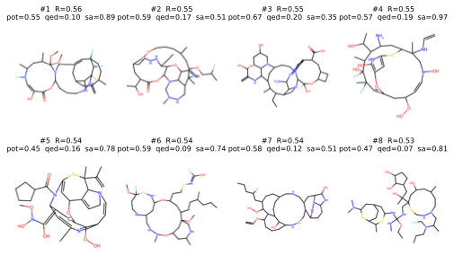

# Deep RL with Graph Neural Networks for Antibiotic Discovery

> Final project, Advanced Machine Learning course, JHU MS in AI program — May 2026

A multi-task GATv2 regressor predicts log10(MIC) for *S. aureus* and *E. coli*, and a three-phase PPO agent uses that signal through a fingerprint surrogate to generate novel antibiotic candidates against both pathogens. Four baseline generators (random construction, genetic algorithm, hill climbing, SMILES-RNN) provide comparison.



## Summary

- **Task.** Multi-task regression of antibacterial MIC (*S. aureus*, *E. coli*) from molecular structure, then PPO-based generative optimization against the resulting potency signal combined with QED, synthetic accessibility, novelty vs DrugBank, and resistance evasion vs CARD.
- **Data.** 78,314 compound–organism observations from ChEMBL (median-aggregated from 112,642 raw MIC measurements), scaffold split 80/10/10. 458 DrugBank antibiotic SMILES for novelty scoring; 457 CARD substrate SMILES for resistance scoring.
- **GNN.** Three-layer GATv2 encoder (128 hidden, 4 heads, mean+max pooling), organism-specific regression heads, masked Huber loss. Test AUROC 0.83 (*S. aureus*) / 0.87 (*E. coli*). The *E. coli* result sits at the empirical noise ceiling estimated from replicate measurements.
- **RL.** PPO with autoregressive type/anchor/target heads on a GATv2 policy, behavior-cloned on expert build trajectories from active antibiotics, KL-anchored to the BC prior (Schulman k3 estimator). Three-phase curriculum: structure exploration (KL=1.0), size ramp 25→30 heavy atoms (KL=0.5), top-100 gated extension. A surrogate fingerprint MLP decouples inner-loop reward calls from the canonical GNN reward used for final scoring. 32 parallel envs, ~20K episodes total.
- **Outcome.** 20,031 unique valid molecules. Beats random, hill-climbing, and SMILES-RNN baselines with Bonferroni-corrected *p* < 10⁻¹⁶ (Cliff's δ 0.97, 0.73, 0.05 respectively — the SMILES-RNN significance is sample-size-driven, not practical). GA wins on raw top-10 reward but mode-collapses onto a single Bemis-Murcko scaffold; RL's pool is fully unique with scaffold dominance 0.003 and the lowest Fréchet ChemNet Distance to the active reference (26.1 vs ≥43.8) of any method tested.
- **Limitations.** ~95% of generated molecules trigger at least one Brenk structural alert and would require medicinal-chemistry refinement before any synthesis. The pipeline does not produce a synthesizable lead. The paper's Limitations section covers the full set of caveats including soft cross-task scaffold leakage and surrogate–GNN agreement (Pearson *r* = 0.52, 63% binary agreement).

## Quick look (no compute required)

To see the results without running anything:

- **[Full paper (PDF)](https://huggingface.co/jsf3467v/antibiotic-discovery/blob/main/paper.pdf)** — tables, figures, methodology, and discussion. Hosted on Hugging Face alongside the checkpoints.
- **`results/metrics/`** — all CSVs that the paper's tables reference (GNN test metrics, RL pool summary, baseline summaries, statistical comparison, distributional metrics).
- **`results/plots/`** — figures referenced in the paper.
- **`demo.ipynb`** — top-20 RL candidates rendered with structures and per-component reward breakdown.

## Setup

Tested on macOS (Apple Silicon, MPS) and Linux (CUDA). Python 3.10+.

```bash
pip install -r requirements.txt
```

To pull the trained checkpoints (~30 MB total) without retraining from scratch:

```bash
hf download jsf3467v/antibiotic-discovery --local-dir models
```

This fetches `gnn_best.pt`, `policy_final.pt`, `surrogate.pt`, and `policy_prior.pt` into `models/`. With these in place, `evaluate.py`, `eval_rl.py`, and `stat_tests.py` reproduce the paper's tables without any training run.

## Data

Three raw inputs are required. Place them in `Datasets/raw/`:

- **ChEMBL 33** SQLite snapshot at `chembl_33/chembl_33_sqlite/chembl_33.db`. Available from the [EBI ChEMBL downloads page](https://chembl.gitbook.io/chembl-interface-documentation/downloads) (CC BY-SA 3.0).
- **DrugBank 5.x** full database export at `full database.xml`. Free for academic use; download from [drugbank.com](https://go.drugbank.com/releases/latest) (account required).
- **CARD** ontology export at `card.json`. Available from the [CARD downloads page](https://card.mcmaster.ca/download) (free, attribution requested).

The EDA notebook reads from raw and writes processed CSVs into `Datasets/processed/`. Total raw data is ~26 GB; the entire `Datasets/` tree is gitignored.

## Reproducing from scratch

Run from the project root in order. Each step caches its output, so re-running a step skips work that's already done. Approximate wall-clock times are for a MacBook Pro M4 Max.

```bash
# 1. Extract and clean data; generates processed CSVs and EDA plots
jupyter notebook EDA/EDA.ipynb

# 2. Train the multi-task GNN regressor              (~2 hours)
python src/train_gnn.py

# 3. GNN test-set metrics (Table 1)                  (<1 min)
python src/evaluate.py

# 4. PPO agent, three phases                         (~6–8 hours)
python src/train_rl.py

# 5. Score the RL pool under the canonical reward    (~5 min)
python src/eval_rl.py

# 6. Train the four baseline generators              (~1 hour)
python src/baselines.py

# 7. Score the baseline pools                        (~5 min)
python src/eval_baselines.py

# 8. Statistical comparison + distributional metrics (~10 min)
python src/stat_tests.py
```

Outputs land in `results/metrics/` and `results/plots/`. Checkpoints land in `models/`.

## Project layout

```
.
├── config.py                  # All hyperparameters and paths
├── requirements.txt
├── README.md
├── src/
│   ├── __init__.py
│   ├── gnn.py                 # Multi-task GATv2 regressor
│   ├── rl.py                  # MDP env, policy, PPO trainer
│   ├── rewards.py             # Composite reward + surrogate
│   ├── feature_engineering.py # Graph featurization
│   ├── train_gnn.py           # GNN training
│   ├── train_rl.py            # PPO training (three phases)
│   ├── baselines.py           # Random, GA, hill-climbing, SMILES-RNN
│   ├── evaluate.py            # GNN test metrics + shared eval utils
│   ├── eval_rl.py             # RL pool evaluation
│   ├── eval_baselines.py      # Baseline pool evaluation
│   └── stat_tests.py          # Mann-Whitney + KL + FCD
├── EDA/
│   ├── EDA.ipynb              # Data extraction + exploratory analysis
│   └── plots/                 # EDA figures (PNG)
├── assets/                    # PNG figures used in this README
├── Datasets/{raw,processed}/  # Not tracked by git (~26 GB)
├── models/                    # Trained checkpoints (download from HF)
└── results/{metrics,plots}/   # Pools, scores, tables, figures
```

## Citation

```bibtex
@misc{keith2026antibiotic,
  author       = {Keith, Arlene},
  title        = {Deep Reinforcement Learning with Graph Neural Networks for Antibiotic Discovery},
  year         = {2026},
  howpublished = {Final project, Advanced Machine Learning course, JHU MS in AI program},
  url          = {https://github.com/jsf3467v/antibiotic-discovery}
}
```

## License

Code is released under the MIT License (see `LICENSE`). The paper PDF is available under CC BY 4.0.
